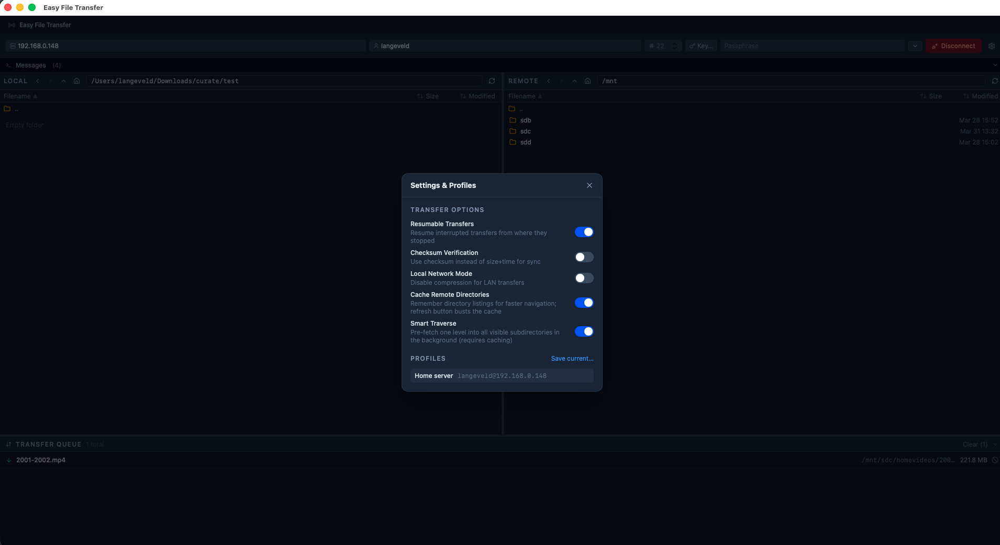
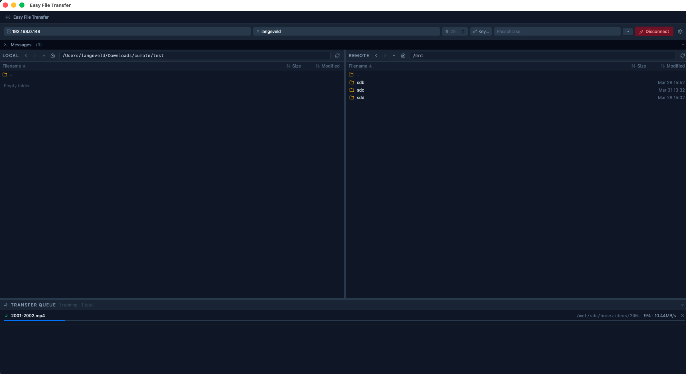

# Easy File Transfer

A lightweight desktop app for transferring files over SSH using `rsync`. Built with [Tauri](https://tauri.app) (Rust) and React + TypeScript.

## Screenshots





## Features

### File Browser

- **Dual-pane browser** — local and remote directories side by side with a draggable vertical divider
- **Drag & drop** — drag files from either pane to the other to start a transfer; drop onto a specific subfolder to target it directly
- **Context menu** — right-click any file or folder to rename, upload/download, or delete; right-click empty space to create a new folder
- **Multi-select** — Shift-click and Ctrl/Cmd-click to select ranges or individual items; bulk operations (delete, upload, download) act on the whole selection
- **Inline rename** — rename files and folders directly in the browser without a popup
- **Inline folder creation** — create a new folder inline with a single right-click
- **Delete with confirmation** — delete one or multiple items with a confirmation dialog showing the item count; works on both local and remote

### Transfers

- **SSH / rsync backend** — all transfers run via `rsync` over SSH for reliability and delta-transfer efficiency
- **Resumable transfers** — uses `--partial-dir=.rsync-partial` so interrupted transfers pick up where they left off
- **Checksum verification** — optionally verify file integrity using checksums instead of size+timestamp
- **Local network optimisation** — disables compression when transferring on a LAN for higher throughput
- **Transfer queue** — run multiple transfers concurrently with live progress bar, speed, ETA, and file counter
- **Cancel** — gracefully cancel any in-flight transfer; partial data is preserved for resumption

### SSH

- **SSH key auth** — select a key file and optionally provide a passphrase
- **Connection profiles** — save and reuse host, user, port, key, and transfer option configurations
- **Remote browser** — navigate the remote filesystem with directory caching and smart pre-fetch for instant traversal

### UI

- **Message log** — timestamped, colour-coded log of all actions (green = success, yellow = warning/delete/cancel, red = error)
- **Resizable panels** — drag the horizontal dividers to resize the message log and transfer queue independently
- **Collapsible panels** — collapse the message log and transfer queue to reclaim screen space

## Prerequisites

- [rsync](https://rsync.samba.org) must be installed and available in `$PATH`
- [Bun](https://bun.sh) (for development)
- [Rust](https://rustup.rs) toolchain

## Pre built mac binaries

see [Releases](https://github.com/Fanna1119/easy-file-transfer/releases)

## Development

```bash
bun install
bun run tauri dev
```

## Build

```bash
bun run tauri build
```

The distributable app bundle is placed in `src-tauri/target/release/bundle/`.

## macOS Distribution (unsigned)

The app is built and shipped as an unsigned `.dmg`. It works, but macOS Gatekeeper will block the first launch.

### What happens without signing

- Gatekeeper flags the app as from an unidentified developer
- User sees: _"cannot be opened because the developer cannot be verified"_
- The app is not broken — it is quarantined, not damaged

### First-launch bypass (choose one)

**Method 1 — right-click (fastest)**

1. Right-click the app → **Open**
2. Click **Open** in the dialog

Gatekeeper creates a permanent whitelist entry for that app.

**Method 2 — System Settings**

1. Try to open the app (it fails)
2. Go to **System Settings → Privacy & Security**
3. Click **Open Anyway**

### Installing from the .dmg

1. Download and open the `.dmg`
2. Drag the app to **Applications**
3. Right-click the app → **Open**
4. Confirm **Open**

> This is required because the app is not signed.

### Remove the quarantine flag (power users)

If you trust the binary and want to skip the prompt entirely:

```bash
xattr -rd com.apple.quarantine /Applications/EasyFileTransfer.app
```

---

## Tech Stack

| Layer    | Technology                       |
| -------- | -------------------------------- |
| Shell    | Tauri 2 (Rust)                   |
| Backend  | Tokio, `rsync` subprocess        |
| Frontend | React 19, TypeScript, Tailwind 4 |
| Bundler  | Vite 7                           |
